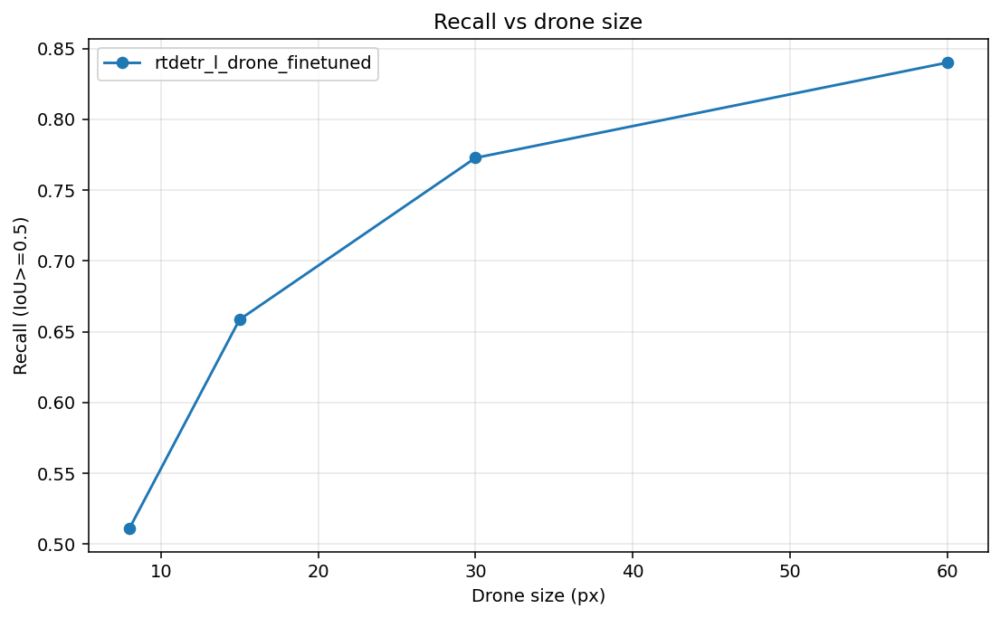

# Synthetic Stress Testing for Skyborne Drone Identification

A controlled synthetic benchmark for measuring **when** and **why** drone detectors fail under size, blur, noise, background, and hard-negative distractors (birds / airplanes).

> Under what visual conditions can a model still identify a drone, and when does it confuse birds or airplanes as drones?

---

## Project Motivation

Drone detection matters for surveillance, airspace monitoring, and related visual recognition tasks. It is hard because drones can be tiny, blurred, noisy, distant, or similar to other flying objects.

Standard detection scores (e.g. a single mAP) do not explain **when** a model fails. A detector may work on large drones but miss 8-pixel targets, or find drones well while also firing on birds.

This project builds a **controlled synthetic stress-test benchmark** so robustness can be measured by known conditions: object size, distractor type, blur, noise, and background type.

---

## Problem Statement

Given a **640×640** sky image, detect whether a drone is present and localize it with a bounding box.

This is a **single-class** detection task:

```text
class 0 = drone
```

Birds and airplanes are **not** target classes. They are distractors used to test false drone identifications.

We evaluate:

1. **Drone detection** — can the model find drones when present?
2. **False-alarm behavior** — does it hallucinate drones on birds/airplanes?
3. **Robustness** — how performance changes under controlled stress factors.

---

## Visual Overview

Key published figures (more under `visuals/`):

| Figure | File |
|--------|------|
| Recall vs drone size | [`visuals/recall_bars.png`](visuals/recall_bars.png) |
| Subset / condition charts | [`visuals/dataset_subsets.png`](visuals/dataset_subsets.png) |
| Example prediction sheets | [`visuals/example_predictions/`](visuals/example_predictions/) |



Hard-negative false-positive rates are reported in the [Results](#results) table (FP image rate and FP box count). The single-model airplane-vs-bird FP bar chart is less informative when both rates are 1.0, so it is not shown here; the file remains under `visuals/false_positive_boxes.png` if needed.

Pipeline / workflow diagrams from the slides can be exported into `visuals/` as `dataset_generation_pipeline.png` and `training_and_evaluation_workflow.png` when available. See also [`slides/final_presentation.pptx`](slides/final_presentation.pptx).

---

## Dataset: `full_curated_v1`

Built by **controlled compositing** of real visual components:

- curated drone cutouts,
- curated bird / airplane cutouts,
- curated sky backgrounds.

| Subset | Description | Images |
|--------|-------------|-------:|
| `synthetic_drone_positive` | drone only | 1,200 |
| `synthetic_distractor_only` | bird or airplane only (no drone) | 1,200 |
| `synthetic_drone_plus_distractor` | drone + bird/airplane | 1,200 |
| **Total** | | **3,600** |

Full images, assets, and checkpoints are **not** in Git (too large). See [`data/dataset_links.md`](data/dataset_links.md).

---

## Data Generation Method

Main steps:

1. Curate real source images.
2. Extract drones, birds, and airplanes as **RGBA** foreground assets (RGB + alpha mask).
3. Curate sky / background images.
4. Sample controlled generation variables (balanced stress grid).
5. Paste objects onto backgrounds in the **upper-sky** region.
6. Apply sampled Gaussian noise and blur to the full image.
7. Save image + YOLO label + metadata row.

### Object extraction (final pack)

| Class | How final assets were produced |
|-------|--------------------------------|
| **Drone** | Manually curated / Gemini cutouts; rembg used when needed for real alpha. Not the SAM2 final path. |
| **Bird / airplane** | SAM2 mask extraction from curated raw scenes, then QA (`qa_final_label=accept`). |
| Intermediate paths | Annotation bbox crops, COCO segmentation, and folder thresholding exist in the codebase for experiments, but only **approved** assets entered `assets_final` for `full_curated_v1`. |

### Controlled variables

| Variable | Values |
|----------|--------|
| Drone size | 8, 15, 30, 60 px |
| Bird size | 8, 15, 30, 60 px |
| Airplane size | 15, 30, 60, 100 px |
| Gaussian noise | σ = 0, 10, 20 |
| Blur | none, mild |
| Background type | clear sky, cloudy sky, natural landscape, built environment, … |
| Placement | upper-sky region |
| Distractor | bird, airplane, or none |

This enables condition-wise metrics (e.g. recall at 8 px, FP rate on bird-only images).

---

## Dataset Subsets

Each subset answers a different question:

### 1. Drone-positive

`drone only` → **Can the model detect a drone when one is present?** (recall)

### 2. Hard-negative (distractor-only)

`bird or airplane, no drone` → **Does the model hallucinate drones?** (false alarms)

### 3. Mixed (drone + distractor)

`drone + bird/airplane` → **Can it find the drone while ignoring a similar non-drone?**

---

## Input / Output

**Input:** synthetic 640×640 RGB sky image (drone-only, distractor-only, or mixed).

**Output:** predicted boxes + confidences, interpreted as drone detections (single class).

- Drone-positive / mixed: a hit needs sufficient overlap with the ground-truth drone box.
- Hard-negative: the correct output is **no** drone box; any prediction is a false positive.

---

## Models

| Model | Type | Training |
|-------|------|----------|
| YOLO11n | lightweight one-stage detector | fine-tuned |
| RT-DETR-L | transformer detector | fine-tuned |
| GroundingDINO | open-vocabulary detector | zero-shot baseline |

GPU training / evaluation was run in **Google Colab** via [`run_gpu.ipynb`](run_gpu.ipynb) (also [`code/notebooks/colab_training_final_clean.ipynb`](code/notebooks/colab_training_final_clean.ipynb)).

---

## Training

YOLO11n and RT-DETR-L were fine-tuned on a stratified final-clean split of all three subsets:

| Split | Total |
|-------|------:|
| Train | 2,520 |
| Validation | 540 |
| Test | 540 |

### YOLO11n (`yolo11n_drone_colab-9`)

| Parameter | Value |
|-----------|-------|
| Pretrained | `yolo11n.pt` |
| Epochs | 30 |
| Batch | 16 |
| Image size | 640 |

| Metric | Value |
|--------|------:|
| Precision | 0.6578 |
| Recall | 0.5028 |
| mAP50 | 0.5373 |
| mAP50-95 | 0.2621 |

### RT-DETR-L (`rtdetr_l_drone_colab-9`)

| Parameter | Value |
|-----------|-------|
| Pretrained | `rtdetr-l.pt` |
| Epochs | 5 |
| Batch | 2 |
| Image size | 640 |

| Metric | Value |
|--------|------:|
| Precision | 0.5556 |
| Recall | 0.4445 |
| mAP50 | 0.4218 |
| mAP50-95 | 0.1706 |

GroundingDINO was **not** fine-tuned.

---

## Evaluation Setup

Held-out test subsets (not used in training):

| Eval subset | Source | Images | Purpose |
|-------------|--------|-------:|---------|
| `test_drone_positive` | drone-positive | 180 | drone recall |
| `test_hard_negative` | distractor-only | 180 | false alarms |
| `test_mixed` | drone + distractor | 180 | detection with distractors |

### Metrics

On drone-containing images: Recall @ IoU 0.25 / 0.50, mean best IoU.

On hard negatives:

- **FP image rate** = images with ≥1 false drone box / total images  
- **FP box count** = total false boxes (can exceed image count)

### Corrected metrics

Report from:

```text
results/combined_metrics/summary_by_model_by_eval_subset_CORRECTED.csv
```

Do **not** use the uncorrected summary. YOLO prediction dumps omitted images with zero detections; those must count as false negatives when a drone is present. Corrected metrics use the full evaluation metadata as the denominator.

Longer write-up: [`docs/final_clean_experiment_results.md`](docs/final_clean_experiment_results.md).

---

## Results

| Model | Recall@0.25 pos | Recall@0.50 pos | Recall@0.25 mixed | Recall@0.50 mixed | Hard-neg FP rate | Hard-neg FP boxes |
|-------|----------------:|----------------:|------------------:|------------------:|-----------------:|------------------:|
| GroundingDINO | 0.622 | 0.539 | 0.450 | 0.372 | 1.000 | 1873 |
| RT-DETR-L | 0.817 | 0.700 | 0.828 | 0.694 | 1.000 | 7218 |
| YOLO11n | 0.728 | 0.683 | 0.722 | 0.678 | 0.344 | 107 |

**Observations**

1. RT-DETR-L has the highest drone recall.
2. YOLO11n has far fewer false positives.
3. GroundingDINO is a useful zero-shot baseline but weaker on this task.
4. Object size is the clearest stress factor; mild blur / noise trends are weaker.

---

## Main Conclusion

Do not evaluate drone detection by recall alone.

A model can find more drones and still hallucinate drones on birds and airplanes. Robust evaluation needs:

```text
target detection metrics
+
hard-negative false-positive analysis
```

In this project, **RT-DETR-L** maximized recall; **YOLO11n** was more selective.

---

## Repository Structure

```text
├── README.md                 # this file
├── requirements*.txt
├── run_gpu.ipynb             # Colab entry
├── code/
│   ├── notebooks/
│   ├── scripts/              # generation, train, eval
│   └── src/drone_stress/
├── configs/                  # full_curated_v1, evaluation, training_*
├── data/                     # samples + dataset_links only in git
├── results/                  # corrected metrics, logs, prediction CSVs
├── visuals/
├── slides/
└── docs/                     # reports + long pipeline guide
```

What is / is not in Git: [`docs/github_vs_drive.md`](docs/github_vs_drive.md).

Detailed CLI history (former long README): [`docs/pipeline_guide.md`](docs/pipeline_guide.md).

---

## How to Reproduce

### 1. Install

```bash
pip install -r requirements.txt
# optional extras:
# pip install -r requirements-yolo.txt
# pip install -r requirements-colab.txt
```

### 2. Download large artifacts

See [`data/dataset_links.md`](data/dataset_links.md) (dataset + weights).

### 3. Generate synthetic data (local)

```bash
python code/scripts/03_generate_synthetic.py --config configs/full_curated_v1.yaml
```

### 4. Train (after you have a YOLO `dataset.yaml` split)

```bash
python code/scripts/train/train_yolo.py \
  --data data/training/<your_split>/dataset.yaml \
  --weights yolo11n.pt --epochs 30 --batch 16 --imgsz 640 --name yolo11n_drone

python code/scripts/train/train_rtdetr.py \
  --data data/training/<your_split>/dataset.yaml \
  --weights rtdetr-l.pt --epochs 5 --batch 2 --imgsz 640 --name rtdetr_l_drone
```

Or use the Colab notebook for GPU runs: `run_gpu.ipynb`.

### 5. Evaluate

```bash
python code/scripts/eval/run_inference.py --config configs/evaluation.yaml
python code/scripts/eval/compute_metrics.py --config configs/evaluation.yaml
python code/scripts/eval/correct_metrics.py --print
```

---

## Large Files

Included here: code, configs, sample images/metadata, corrected metrics, training summaries, prediction CSVs, figures, docs, slides.

Not included: full raw/processed/synthetic image trees, model weights (`.pt` / `.pth`), temporary Colab `outputs/`.

---

## Acknowledgments

Course project in practical generative AI for images and audio. The contribution is a **controlled synthetic stress-test benchmark** for skyborne drone identification boundaries and false-identification behavior—not a claim that no drone datasets exist.
